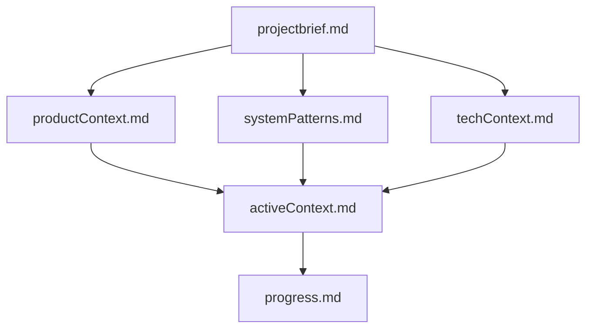

# CaseThread Memory Bank

This directory contains the complete memory bank for the CaseThread project. The memory bank serves as persistent context and documentation that survives between development sessions.

## Structure Overview

```
memory-bank/
├── README.md              # This file - memory bank overview
├── projectbrief.md        # 🏗️  Foundation document and project scope
├── productContext.md      # 🎯  Product vision and user experience
├── systemPatterns.md      # 🏛️  Architecture and design patterns
├── techContext.md         # ⚙️  Technology stack and constraints
├── activeContext.md       # 🔄  Current work focus and next steps
└── progress.md            # 📊  Implementation progress tracking
```

## File Dependencies

The memory bank files build upon each other in a logical hierarchy:



## How to Use

### For Development Sessions
1. **Start Here**: Always read `activeContext.md` first for current status
2. **Reference**: Use other files as needed for context
3. **Update**: Modify `activeContext.md` and `progress.md` as work progresses

### For Major Updates
1. **Review All Files**: Check every file for accuracy
2. **Update Context**: Modify relevant files with new information
3. **Maintain Consistency**: Ensure all files align with current state

### For New Team Members
1. **Start with**: `projectbrief.md` for project overview
2. **Follow with**: `productContext.md` for product understanding
3. **Technical Details**: `systemPatterns.md` and `techContext.md`
4. **Current State**: `activeContext.md` and `progress.md`

## File Descriptions

### 🏗️ projectbrief.md
- **Purpose**: Foundation document that shapes all other files
- **Contains**: Project scope, goals, success criteria, and boundaries
- **Update Frequency**: Rarely (only when project scope changes)
- **Key For**: Understanding what CaseThread is and why it exists

### 🎯 productContext.md
- **Purpose**: Product vision and user experience goals
- **Contains**: Problems solved, user workflows, design principles
- **Update Frequency**: Occasionally (when UX insights are gained)
- **Key For**: Understanding user needs and product direction

### 🏛️ systemPatterns.md
- **Purpose**: Technical architecture and design decisions
- **Contains**: System architecture, design patterns, component relationships
- **Update Frequency**: When architectural decisions are made
- **Key For**: Understanding how the system is structured

### ⚙️ techContext.md
- **Purpose**: Technology stack and development environment
- **Contains**: Technologies used, dependencies, setup instructions
- **Update Frequency**: When technology choices are made or changed
- **Key For**: Understanding development environment and constraints

### 🔄 activeContext.md
- **Purpose**: Current work focus and immediate priorities
- **Contains**: Current sprint, recent changes, next steps, active decisions
- **Update Frequency**: Every development session
- **Key For**: Understanding what's happening now and what's next

### 📊 progress.md
- **Purpose**: Implementation progress and roadmap tracking
- **Contains**: Completed work, remaining tasks, roadmap, metrics
- **Update Frequency**: After significant implementation milestones
- **Key For**: Understanding project status and what's been built

## Maintenance Guidelines

### Regular Updates
- Update `activeContext.md` every development session
- Update `progress.md` after completing major features
- Review all files when project direction changes

### Consistency Checks
- Ensure all files reflect the current project state
- Verify no contradictory information between files
- Keep technical details in sync with actual implementation

### Quality Standards
- Use clear, concise language
- Maintain consistent formatting and structure
- Include specific examples and concrete details
- Avoid redundancy between files

## Integration with Development

### Before Starting Work
1. Read `activeContext.md` for current priorities
2. Check `progress.md` for recent changes
3. Reference other files as needed for context

### During Development
1. Note important decisions and discoveries
2. Track progress against planned goals
3. Identify any changes that affect documentation

### After Completing Work
1. Update `activeContext.md` with progress made
2. Update `progress.md` with completed items
3. Update other files if architectural changes were made

## Version Control

- All memory bank files are version controlled with the project
- Changes should be committed with clear commit messages
- Major updates should include explanation of changes
- Consider the memory bank as critical project documentation

---

*This memory bank was initialized from contextInit.txt on the current date. It serves as the persistent context for the CaseThread project development.* 